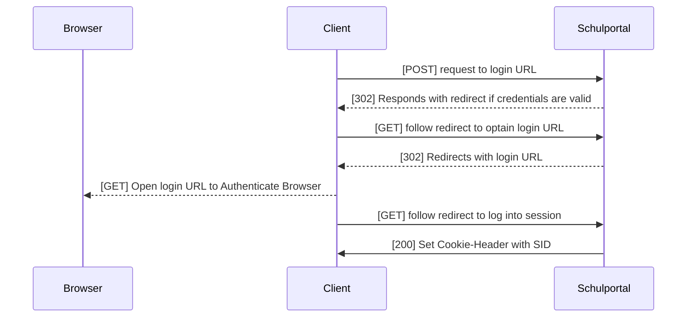

Das Schulportal selber bietet keine direkte REST API, über die Daten einfach abgegriffen werden können. Stattdessen werden die HTML Dokumente heruntergeladen und deren Daten ausgelesen. Diesen Vorgang wird Parsing genannt.

### Grundlagen
Das Schulportal selber besteht aus [vielen verschiedenen Modulen](https://info.schulportal.hessen.de/das-sph/sph-ueberblick/). Der Teilbereich, auf die wir uns hier Fokussieren, ist die [Pädagogische Organisation](https://info.schulportal.hessen.de/das-sph/sph-paedorg/), die durch ihre Applets Lösungen für viele Probleme des Schulaltags bietet. Nicht jede Schule verwendet die selben Applets. Jede Schule aktiviert Applets auf basis ihrer Anforderungen. 

Jede Schule hat eine eigene Schul-ID. Die [Schuldatenbank des Hessischen Bildungsservers](https://schul-db.bildung.hessen.de/schul_db.html) ist zwar etwas veraltet, aber sie bietet einen guten Einstieg in das Verständnis des Schulportals. 

### Schulinfomrationen erhalten
Glücklicherweise müssen keinerlei Authorisationen erfolgen, um einige Schuldaten zur erhalten. Der Schulportal Path `exporteur.php?[]` gibt einige Infomrationen von nutzen zurück. Hier eine grobe Auflistung:

```url
[GET] https://startcache.schulportal.hessen.de/exporteur.php?a=schoollist
→ JSON mit allen verfügbaren Schulen nach Landkreis sortiert. 

[GET] https://startcache.schulportal.hessen.de/exporteur.php?a=school&i=<schoolID>
→ JSON mit Schulspezifischen kosmetischen Informationen.

[GET] https://startcache.schulportal.hessen.de/exporteur.php?a=schoollogo&i=<schoolID>
→ Schullogo, sofern vorhanden

[GET] https://startcache.schulportal.hessen.de/exporteur.php?a=schoolbg&i=<schoolID>&s=<xs|sm|md|lg>
→ Hintergrundbild der Schule in verschiedenen Auflösungen. 
```

### Authentication & Authorisation
Um mit dem Schulortal zu interagieren muss (fast) jede Anfrage autorisiert werden. Dies passiert durch den "sid" (=Session ID) Cookie, der bei der Authentifizierung erhalten wird. 

Das Folgende Schema beschreibt den Authentifizierungs-Workflow des Schulportals (nur Pädergogische Organisation), den der Webbrowser macht.



Um sicherzustellen, dass der Login erfolgreich abläuft, müssen die Cookies bei jeder Anfrage genauso, wie im Browser geparsed werden. Andernfalls ist eine Authentifizierung nicht möglich.

**request to login URL**
```url
Method: POST
URL: "https://login.schulportal.hessen.de/?i=$schoolID"

Query Parameters:
- user: "schoolID.username"
- user2: "username"
- password: "password"

Options:
- Content Type: "application/x-www-form-urlencoded"
```

### Ende-zu-Ende Verschlüsselung
Einige inhalte im Schulporal sind durch eine 2nd level verschlüsselung zusätzlich abgesichert. Wird der HTML quellcode der Server-Response betrachtet, dann fällt ziemlich schnell auf, dass die HTML-Tags, mit den gewünschten Informationen nicht vorhanden sind und stattdessen an deren Stelle ein `<encoded>` Tag mit dem verschlüsselten Informationen vorhanden ist. Werden diese Informationen Decodiert und an stelle des '<encoded>' Tags 

Dabei verwendet das Schulportal eine veraltete Libary jCryption.

Während einige inhalte des Schulportals durch diese Verschlüsselung abgesichert sind, sind viele Elemente auch ohne Verschlüsselung zugänglich. Beispielsweise benötigt man für den Vertretungsplan, den Kalender oder den Stundenplan keine zusätzliche Entschlüsselung. Wenn Inhalte privat werden gibt es in der Regel zusätzliche Verschlüsselungen. ("Mein Unterricht"; "Nachrichten")

Eine funktionierende Version der Entschlüsselung haben wir [hier Implementiert](https://github.com/alessioC42/lanis-mobile/blob/main/app/lib/client/cryptor.dart). 

> [!NOTE]
> Das Geniale an dieser Verschlüsselung ist, dass sobald ein Hacker tatsächlich das erste HTTPS-Layer geknackt hat, er automatisch Zugriff auf das klartext Passwort (bei der Login request) und die Session-ID hat und die zweite Schicht eigentlich keinen Sinn mehr macht. 

### unterstützte Applets Auflisten
Ein Punkt, an dem ich andere Projekte (und anfangs auch dieses) scheitern sehe ist der korrekte Umgang mit mehrschulischem Support. Da verschiedene Schulen (und andere Account-Typen) unterschiedlichen Applet zugang haben ist es wichtige diese Korrekt zu erkennen. 

Dazu kann man sich das Navigationsmenü zu nutze machen, da sieses dynamisch über eine AJAX request geladen wird. 


```url
[GET] https://start.schulportal.hessen.de/startseite.php?a=ajax&f=apps
```
Ein Fehler, den wir gemacht haben, ist das Matchen der Applets nach ihren Namen. Es stellte sich heraus, dass die Namen von den Schulen geändert werden könnten. Stattdessen sollte auf das Feld `link` geprüft werden, da sich dieses nicht dynamisch ändern lässt. 


### Regex vs. CSS selector & Browser like API's
Beim Parsen von HTML Dokumenten gibt es erstmal zwei grundlegende Ansätze.

**RegEx**


[Regex](https://en.wikipedia.org/wiki/Regular_expression) kann aus einem HTML String Informationen aufgrund ihrer Eigenschaften als String extrahieren oder testen. Gleichzeitig ist die [Regex](https://en.wikipedia.org/wiki/Regular_expression) Syntax für viele Entwickler (mich eingeschlossen) ein einziger Alptraum. ([RegEx Symbolbilder](https://www.reddit.com/r/ProgrammerHumor/search/?q=regex)) Das bedeutet nicht, dass RegEx per se schlecht ist. Tatsächlich kommen RegEx in der App relativ häufig vor.

Wenn es an das Parsen von komplexeren Datenstrukturen geht, dann ist RegEx jedoch schnell zu kompliziert bzw. zu unorganisiert. Stattdessen werden oft Parsing-Libraries wie [Beautiful Soup](https://pypi.org/project/beautifulsoup4/) oder [Dart's HTML](https://pub.dev/packages/html) verwendet, um Daten viel einfacher auszulesen.

- Pro's:
  - Mächtige und flexible Methode zum Analysieren von Texten.
  - Kann für einfache Muster schnell und **effizient** sein.
- Con's:
  - Schwierig zu lesen und zu verstehen, insbesondere für komplexe Muster.
  - Nicht spezifisch für HTML, daher kann es zu unerwarteten Ergebnissen führen.


**CSS selector & Browser like API's:**

CSS selektoren bieten eine einfachere und intuitivere Möglichkeit, HTML-Elemente zu selektieren und deren Inhalte zu extrahieren. Im Vergleich zu RegEx sind sie oft einfacher zu schreiben und zu lesen, besonders für Entwickler, die mit CSS und/oder JS vertraut sind. Browser-ähnliche APIs wie XPath und jQuery ermöglichen eine ähnliche Syntax und Funktionalität wie CSS-Selektoren, was die Arbeit mit HTML-Dokumenten weiter vereinfacht.
- Pro's:
  - Intuitive Syntax, besonders für Entwickler mit CSS-Kenntnissen.
  - Gut geeignet für das selektive Extrahieren von HTML-Elementen.
- Con's:
  - Kann an seine Grenzen stoßen, wenn es um komplexere Datenstrukturen geht.
  - Abhängig von der Struktur des HTML-Dokuments und kann daher bei Änderungen brüchig sein.

